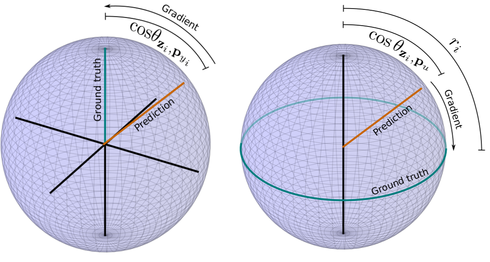

# Hyperspherical Prototype Networks
This repository contains the PyTorch code for the NeurIPS 2019 paper "Hyperspherical Prototype Networks".
<br>
The paper is available here: https://arxiv.org/abs/1901.10514
<br><br>

<br><br>
The repository includes:
* Download link for pre-computed prototypes.
* Classification scripts for CIFAR-100, ImageNet-200, and CUB Birds.
* Script to construct your own prototypes.
* Joint classification and regression script for OmniArt.

## Downloading and constructing hyperspherical prototypes

To obtain prototypes pre-computed for the paper, perform the following steps:
```
cd prototypes/
wget -r -nH --cut-dirs=3 --no-parent --reject="index.html*" http://isis-data.science.uva.nl/mettes/hpn/prototypes/
cd ..
```
The folder 'sgd' denotes the prototypes without semantic priors, 'sgd-sem' with semantic priors. The folders 'sem' and 'simplex' denote the baseline prototypes of Table 1.
<br><br>
To create your own prototypes, use the prototypes.py script. An example run for 100 classes and 50 dimensions:
```
python prototypes.py -c 100 -d 50 -r prototypes/sgd/
```
In case you want to construct prototypes on CIFAR-100 or ImageNet-200 with word2vec representations, please download the wtv files as follows:
```
mkdir -p wtv
cd wtv/
wget -r -nH --cut-dirs=3 --no-parent --reject="index.html*" http://isis-data.science.uva.nl/mettes/hpn/wtv/
cd ..
```

## Running hyperspherical prototype networks

To perform classification and joint optimization with Hyperspherical Prototype Networks, use the scripts that start with 'hpn_'.
<br>
For CIFAR-100 using 50-dimensional prototypes without semantic priors (akin to column 4 of Table 1 of the paper), run the following:
```
python hpn_cifar.py --datadir data/ --resdir res/ --hpnfile prototypes/sgd/prototypes-50d-100c.npy --seed 100
```
All the other scripts work precisely the same.
<br><br>
The CUB Birds dataset can be obtained from the original dataset: http://www.vision.caltech.edu/visipedia/CUB-200-2011.html
<br>
The prepared ImageNet-200 and OmniArt datasets can be obtained as follows:
```
cd data/
wget -r -nH --cut-dirs=3 --no-parent --reject="index.html*" http://isis-data.science.uva.nl/mettes/hpn/data/imagenet200/
wget -r -nH --cut-dirs=3 --no-parent --reject="index.html*" http://isis-data.science.uva.nl/mettes/hpn/data/omniart/
cd ..
```
Please cite the paper accordingly:
```
@inproceedings{mettes2019hyperspherical,
  title={Hyperspherical Prototype Networks},
  author={Mettes, Pascal and van der Pol, Elise and Snoek, Cees G M},
  booktitle={Advances in Neural Information Processing Systems},
  year={2019}
}
```
